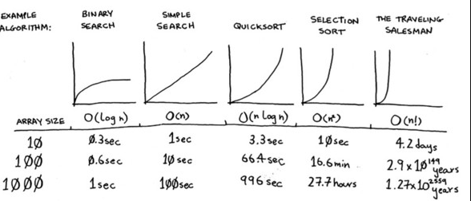

# Learning the basic principles of algorithms using Python
## Source:
- **Grokking Algorithm** by Aditya Bharga [GitHub](https://github.com/egonSchiele/grokking_algorithms)

## Algorithms

Big O notation is the measure to see how an algorithm perform according to differents input dimension

### Binary Search
- Getting the result by dividing a dataset in 2 equal portions each time. It is more efficient than simple search and the worst case scenario can be calculated throw $log{_2}{n}={x}$ where n is the number of elements in the sorted list, while x represents the maximum's attempts. The big O notation here is $O(log{_2}{n})$

### Selection Sort
- Sorting the element of a list: it is quite expensive since it takes O(n^2) to complete the action

### Recursive
- An approach where a function calls itself. In order to avoid infinite loop it's always made up by 2 parts:
  - base case --> when the function doesn't call itself again
  - recursive case
   
An example with factorial:

`def fact(x):
  if x == 1:
    return 1
  else:
    return x * fact(x-1)`

### Divide and Conquer (D&C)
- Reduce the case to the most basic one. Once this is done, apply that to the whole context

### Quick Sort
- Sorting algorithm faster than selection sort: the process starts with breaking down the array, getting an item as reference (*pivot*) and divide the list in 2 parts (*partitioning*), one with lower numbers and one with greater.  
Finally, apply the sort element to both sub-arrays.   
In the worst case is slow as selection sorts but in the average case it outplays the selection sort's algorithm
O notation: $n * log{_2}{n}={x}$

---
 

### Hash function
- Data structure that return a number mapped with the input string which was provided. It's important for hash functions to consistently return the same output for the same input. This feature can be combined with array and make an *hash table* (in Python Dictionaries).  
In order to avoid the collision it's important to set a reasonable load factor (LF)  
The formula:  `$n. items / n. slots$`  
Once the LF is greater than 0.7 it's time to resize the hash table (twice the size)

